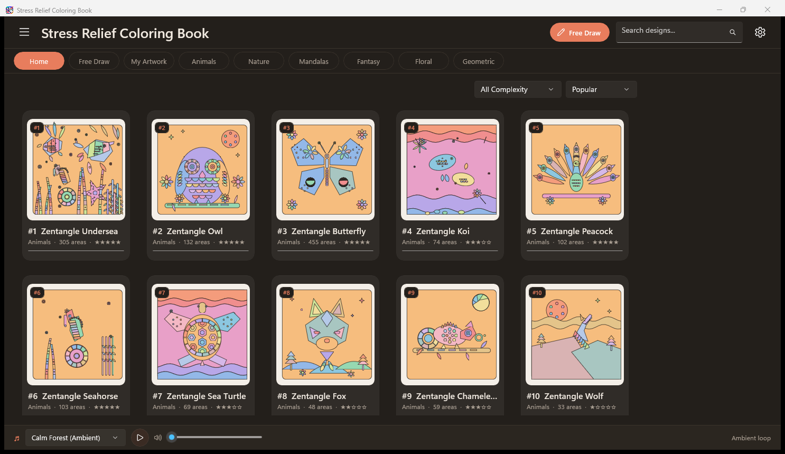

# Adult ColoringBook

<div align="center">


**A serene, full-featured adult coloring studio built with WinUI 3 and .NET 8.**  
*Unwind with high-detail zentangles, mandalas, florals, soothing ambient soundtracks, and procedural audio.*

[**⬇️ Download Latest Portable Release**](https://github.com/uponatime2019/NewColoringbook/releases/latest) • [**Features**](#features) • [**Keyboard Shortcuts**](#keyboard-shortcuts) • [**Build Instructions**](#building--running) • [**Roadmap**](#roadmap)

</div>

---

## 🎨 Overview & Screenshots

**Adult ColoringBook** is an open-source, unpackaged Windows desktop coloring book designed for relaxation and mindfulness. Featuring a curated collection of intricate line-art categories—from complex zentangles and animals to mandalas and geometric patterns—it provides intuitive click-to-fill region coloring, freeform drawing brushes, rich textures, and built-in ambient audio loops.



---

## 🚀 Try It Now / Zero-Install Download

No installer or Microsoft Store account required.

1. Download the standalone portable archive:  
   👉 [**Download NewColoringbook-v1.0.0-win-x64.zip**](https://github.com/uponatime2019/NewColoringbook/releases/latest)
2. Extract the `.zip` archive to any directory.
3. Launch `NewColoringbook.exe` and begin coloring immediately!

---

## ✨ Features

- 🧘 **Stress-Relief Coloring Studio**:
  - Smart region-fill engine with texture and gradient support.
  - Freeform brush drawing with adjustable stroke size and colors.
  - Precision eraser and full undo / redo stack (`Ctrl+Z`, `Ctrl+Y`).
  - Blank canvas **Free Draw** mode for limitless creativity.
- 🎶 **Built-in Ambient Soundtracks**:
  - Enjoy 8 soothing audio tracks including *Gentle Rain*, *Ocean Waves*, *Forest Stream*, *Wind in Trees*, *Campfire*, *Piano Melody*, *Wind Chimes*, and a procedurally synthesized *Calm Forest* loop.
  - Persistent ambient music player across all pages with custom volume control.
- 📂 **Organized Catalog**:
  - Categorized gallery: Animals, Nature, Mandalas, Fantasy, Floral, Geometric, and Zentangle.
  - Filter by complexity rating (★☆☆☆☆ to ★★★★★) and sort by popularity, name, or coloring progress.
  - Automatic progress tracking and auto-saving to local storage.
- 🖼️ **Export & Print**:
  - High-resolution paper-backed PNG rendering and export.
  - Direct Windows Share integration and local artwork gallery.
- 🔒 **100% Offline & Private**:
  - Pure unpackaged desktop app. No account registration, telemetry, tracking, or network permissions required.

---

## ⌨️ Keyboard Shortcuts

| Shortcut | Action |
| :--- | :--- |
| <kbd>F</kbd> | Activate **Fill** tool |
| <kbd>B</kbd> | Activate **Brush** tool |
| <kbd>E</kbd> | Activate **Eraser** tool |
| <kbd>Ctrl</kbd> + <kbd>Z</kbd> | Undo last stroke or fill |
| <kbd>Ctrl</kbd> + <kbd>Y</kbd> / <kbd>Ctrl</kbd> + <kbd>Shift</kbd> + <kbd>Z</kbd> | Redo |
| <kbd>+</kbd> / <kbd>-</kbd> | Zoom in / Zoom out |
| <kbd>0</kbd> | Reset zoom and fit view |
| Mouse Drag | Pan canvas across the studio |
| Mouse Wheel | Zoom canvas in / out |

---

## 🛠️ Building & Running

### Prerequisites
- [Windows 10 version 1809 (Build 17763) or Windows 11](https://www.microsoft.com/windows)
- [.NET 8.0 SDK](https://dotnet.microsoft.com/download/dotnet/8.0)
- Visual Studio 2022 (v17.8+) with the **.NET Desktop Development** and **Windows App SDK** workloads.

### Build via Command Line
```powershell
# Clone the repository
git clone https://github.com/uponatime2019/NewColoringbook.git
cd NewColoringbook

# Build the project
dotnet build "NewColoringbook.csproj" -p:Platform=x64

# Run the app
dotnet run --project "NewColoringbook.csproj"
```

### Standalone Release Publish
To generate a fully self-contained portable directory:
```powershell
dotnet publish "NewColoringbook.csproj" -c Release -p:Platform=x64 -o "publish/NewColoringbook_Portable"
```

---

## 🗺️ Roadmap

- [ ] **Custom SVG / Vector Import**: Allow users to import their own line art SVG files for custom coloring.
- [ ] **Gradient Palettes & Shading**: Multi-stop gradient fills and soft shadow blending.
- [ ] **Pen & Stylus Pressure Sensitivity**: Native WinRT InkCanvas pressure response for Surface Pen and Wacom tablets.
- [ ] **Custom Color Palette Builder**: Save and export user-defined harmonic palettes.
- [ ] **Timelapse Replay**: Watch an animated replay of your coloring process from start to finish.

---

## 🤝 Contributing & Community

Contributions are warmly welcomed! Feel free to:
- ⭐ Star the repository if you find it relaxing or helpful.
- 🐛 [Report a bug](https://github.com/uponatime2019/NewColoringbook/issues) or propose new artwork designs.
- 🔀 Submit a Pull Request. Check out [CONTRIBUTING.md](CONTRIBUTING.md) for detailed guidelines.

---

## 📄 License

This project is licensed under the [MIT License](LICENSE).
